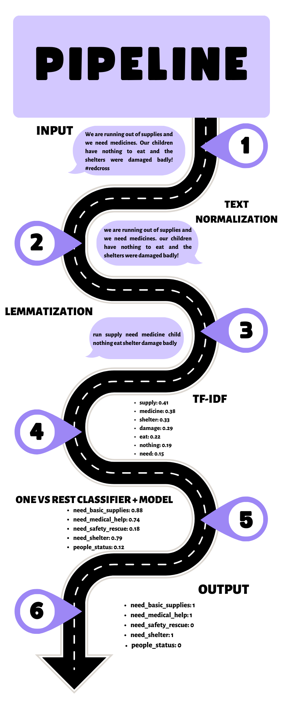
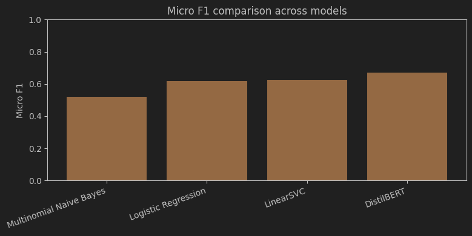

# Crisis Help Classification
## Project Goal
The goal of this project is to develop an AI Crisis Help Classification system that analyzes a disaster-related text message and predicts which humanitarian needs apply to each message. The labels narrow to *need_basic_supplies*, *need_medical_help*, *need_safety_rescue* , *need_shelter* and *people_status*. A single message can belong to multiple labels, which is why this task is formulated as a multi-label text classification problem.
### How each target was created
Originally, the raw disaster dataset each message consists of 36 binary annotated labels (target variables). For the purposes of this project some labels were grouped to match the goal of this project - the grouped targets were assigned with 1 only when any of its source labels was also 1.
 - *Need_basic_supplies* - water, food, clothes
 - *Need_medical_help* - medical_help, medical_products, hospitals
 - *Need_safety_resue* - security, military, search_and_rescue
 - *Need_shelter* - shelter
 - *People_status* - missing_people, death, refugees

**A message could have:**
 - all targets = 0 - when the message is not a request for help or when the message asks for help that is not within the defined target variables
 - one target = 1 - when the message mentions exactly one of the needs above
 - multiple targets = 1 - when the message contains more than 1 need at the same time

## Data Characteristics
 - **Selected feature:** message
 - **Target variables:**
   - need_basic_supplies (0/1)
   - need_medical_help (0/1)
   - need_safety_rescue (0/1)
   - need_shelter (0/1)
   - people_status (0/1)

#### Example
*Input message:*
Please help us, my child is sick, we need water and food, and we have nowhere to live.

*Output:*
 - Need_basic_supplies: 1
 - Need_medical_help: 1
 - Need_safety_and_rescue: 0
 - Need_shelter: 1
 - People_status: 0

## Pipeline

  

## Model Comparison

  

